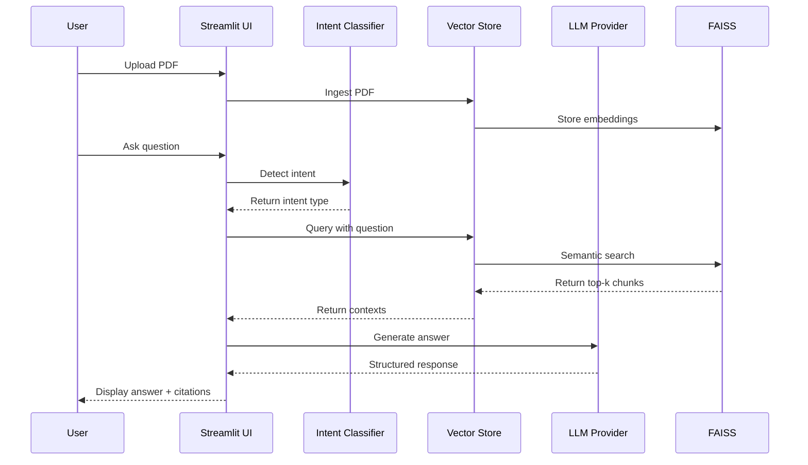

# EduMentor AI - Agentic Tutoring for JEE/NEET


EduMentor AI is an AI-powered tutoring system tailored for JEE Main, JEE Advanced, and NEET preparation. It uses a Retrieval-Augmented Generation (RAG) architecture to provide accurate, context-aware answers from uploaded study materials and leverages Google Gemini for generating structured, student-friendly responses.

---

## Project Overview

EduMentor AI enables students to upload study PDFs, run semantic search against the content, and receive exam-focused, structured answers with source citations. Key components include PDF ingestion, automatic chunking and embedding storage, an intent classifier to detect the type of question, and a Gemini-based LLM provider for natural language generation.

---

## Key Features

- **PDF Ingestion**: Upload and process PDF study materials with automatic chunking and indexing.
- **Intent Classification**: Detects common question types (definition, derivation, numerical, conceptual) using regex-based patterns found in [edumentor/intent/classifier.py](edumentor/intent/classifier.py).
- **RAG-Based Retrieval**: Uses FAISS vector store and FastEmbed embeddings for semantic search (see [edumentor/retrieval/vectorstore.py](edumentor/retrieval/vectorstore.py)).
- **Gemini LLM Integration**: Generates structured answers with citations using Google Gemini via [edumentor/llm/providers.py](edumentor/llm/providers.py).
- **Source Citations**: Responses include references to pages and documents for verification.
- **Exam-Focused**: Prompting and response structure tailored for JEE Main, JEE Advanced, and NEET syllabi.
- **Interactive UI**: Clean Streamlit interface with configurable retrieval parameters (implemented in [app/app.py](app/app.py)).

---

## Architecture Diagram



---

## Prerequisites

- **Python**: 3.8 or higher
- **Google API Key**: Required for Gemini LLM access (obtain from Google AI Studio)
- **Operating System**: Windows, macOS, or Linux
- **Disk Space**: Minimum 500MB for dependencies and vector database

---

## Installation

Step 1: Clone the Repository

```bash
git clone <repository-url>
cd "intern 1"
```

Step 2: Create Virtual Environment

```bash
# Windows
python -m venv venv
venv\Scripts\activate

# macOS/Linux
python3 -m venv venv
source venv/bin/activate
```

Step 3: Install Dependencies

```bash
pip install -r requirements.txt
```

Key dependencies (listed in `requirements.txt`):

- `streamlit`
- `faiss-cpu`
- `fastembed`
- `pymupdf`
- `google-generativeai`
- `python-dotenv`
- `pydantic`
- `tqdm`

---

## Configuration

Step 1: Create Environment File

```bash
# Create .env file in project root
# macOS/Linux
touch .env
# Windows
type nul > .env
```

Step 2: Add API Key

Example `.env` template:

```env
GOOGLE_API_KEY=your_google_api_key_here
GEMINI_MODEL=gemini-flash-latest
STORAGE_DIR=storage
```

Step 3: Obtain Google API Key

- Visit Google AI Studio (https://makersuite.google.com/app/apikey)
- Create a new API key
- Copy and paste it into the `.env` file

Configuration is loaded via [edumentor/config.py](edumentor/config.py) using `python-dotenv`.

---

## Usage

Starting the application

```bash
streamlit run app/app.py
```

The app opens at `http://localhost:8501` (default).

Using the App

- **Select Exam Focus**: Choose from JEE Main, JEE Advanced, or NEET in the sidebar.
- **Upload Study Materials**: Click "Upload PDFs" in the sidebar, select one or multiple PDFs, and wait for ingestion (progress is displayed).
- **Adjust Retrieval Settings**: Use the "Retrieved Snippets" slider (1-10) for context size.
- **Ask Questions**: Enter your question and click "Generate Answer" to get structured responses with citations.
- **Review Sources**: Check the "Retrieved Sources" section for document references.

Question types supported:

- **Definition**: E.g., "What is Newton's second law?"
- **Derivation**: E.g., "Derive the equation for kinetic energy"
- **Numerical**: E.g., "Calculate the force when mass is 5kg and acceleration is 2m/s²"
- **Conceptual**: E.g., "Explain why the sky is blue"

---

## Project Structure

```
intern 1/
├── app/
│   └── app.py                    # Streamlit application entry point
├── edumentor/
│   ├── __init__.py
│   ├── config.py                 # Configuration and settings management
│   ├── ingest/
│   │   └── ingest.py             # PDF ingestion and processing
│   ├── intent/
│   │   └── classifier.py         # Question intent detection
│   ├── llm/
│   │   └── providers.py          # LLM provider integration (Gemini)
│   └── retrieval/
│       └── vectorstore.py        # FAISS vector store operations
├── storage/
│   ├── faiss/                    # FAISS persistent storage
│   └── docs/                     # Uploaded PDF documents
├── .streamlit/
│   └── config.toml               # Streamlit theme configuration
├── .env                          # Environment variables (API keys)
├── requirements.txt              # Python dependencies
└── README.md                     # This file
```

Module descriptions:

- `app/app.py`: Main Streamlit UI, file upload, question input, and answer display. See [app/app.py](app/app.py).
- `edumentor/config.py`: Loads environment variables and manages storage paths. See [edumentor/config.py](edumentor/config.py).
- `edumentor/ingest/ingest.py`: Extracts text using PyMuPDF, chunks content, and stores in vector DB. See [edumentor/ingest/ingest.py](edumentor/ingest/ingest.py).
- `edumentor/intent/classifier.py`: Regex-based intent detection. See [edumentor/intent/classifier.py](edumentor/intent/classifier.py).
- `edumentor/llm/providers.py`: Builds prompts and interfaces with Google Gemini. See [edumentor/llm/providers.py](edumentor/llm/providers.py).
- `edumentor/retrieval/vectorstore.py`: Manages FAISS operations, embeddings, and semantic search. See [edumentor/retrieval/vectorstore.py](edumentor/retrieval/vectorstore.py).

---

## Technical Details

RAG Pipeline:

1. **Ingestion**: PDFs are processed page-by-page using `fitz` (PyMuPDF) in [edumentor/ingest/ingest.py](edumentor/ingest/ingest.py).
2. **Chunking**: Text is split into 800-word chunks with 100-word overlap (see `chunk_text()` in [edumentor/retrieval/vectorstore.py](edumentor/retrieval/vectorstore.py)).
3. **Embedding**: FastEmbed generates vector embeddings for each chunk.
4. **Storage**: FAISS persists embeddings in `storage/faiss/`.
5. **Retrieval**: User questions are embedded and matched to stored chunks using cosine similarity.
6. **Generation**: Top-k contexts are passed to Gemini with structured prompts from `build_prompt()` in [edumentor/llm/providers.py](edumentor/llm/providers.py).

Intent classification logic (see [edumentor/intent/classifier.py](edumentor/intent/classifier.py)):

- **Definition**: Matches "define", "what is"
- **Derivation**: Matches "derive", "prove", "show that"
- **Numerical**: Matches "calculate", "find", "compute" and unit patterns (m, kg, s, etc.)
- **Conceptual**: Default if no other matches; matches "explain", "why", "how"

---

## Troubleshooting

| Issue | Solution |
|-------|----------|
| **"Add your API key in the .env file"** | Ensure `GOOGLE_API_KEY` is set in `.env` and restart the app. App warns in [app/app.py](app/app.py#L16-L17) when missing. |
| **"System not configured"** | Verify the API key is valid and has Gemini API access enabled (see [edumentor/config.py](edumentor/config.py)). |
| **PDF upload fails** | Check PDF is not corrupted and contains selectable text (not scanned images). Use OCR-processed PDFs if needed. |
| **No results returned** | Ensure PDFs were ingested successfully; check terminal logs for errors. |
| **Slow embedding generation** | First run downloads FastEmbed model (~100MB); subsequent runs are faster. |
| **FAISS errors** | Remove `storage/faiss/` and re-ingest PDFs. |
| **Import errors** | Reinstall dependencies: `pip install -r requirements.txt --force-reinstall` |
| **Port already in use** | Change Streamlit port: `streamlit run app/app.py --server.port 8502` |

Common issue notes:

- **Missing API Key**: If the sidebar warns about a missing `GOOGLE_API_KEY`, add it to `.env` and restart.
- **Embedding Model Download**: FastEmbed's model downloads on the first run; allow time for the download.
- **PDF Text Extraction**: If text extraction fails for scanned PDFs, use OCR-processed versions.
- **Memory Considerations**: Large PDFs or many documents may consume RAM — reduce `top_k` or process fewer documents.

---

## Advanced Usage

Command-Line PDF Ingestion:

```bash
# Ingest a single PDF
python -m edumentor.ingest.ingest path/to/document.pdf

# Ingest all PDFs in a folder
python -m edumentor.ingest.ingest path/to/folder/
```

Customizing Chunk Size:

- Modify `chunk_size` and `chunk_overlap` in `chunk_text()` located in [edumentor/retrieval/vectorstore.py](edumentor/retrieval/vectorstore.py) (default: 800 words, 100-word overlap).

Changing LLM Model:

- Update `GEMINI_MODEL` in `.env` to try different Gemini variants (e.g., `gemini-pro`, `gemini-flash-latest`).

Streamlit Theme Customization:

- Edit `.streamlit/config.toml` to change the UI theme and fonts.

---

## Contributing & License

- **Contributing**: Fork, branch, and open a PR with a clear summary and tests (if applicable). Use issues to report bugs or request features.
- **License**: Add a license file (`LICENSE`) to the repository to indicate the project license (MIT, Apache, etc.).
- **Contact**: For support, open an issue or reach out to the maintainers.

---

## Acknowledgments

- Google Gemini for LLM capabilities
- FAISS for vector storage
- FastEmbed for efficient embeddings
- Streamlit for rapid UI development
- PyMuPDF for PDF processing

---

If you want me to also add a CODE_OF_CONDUCT, CONTRIBUTING.md, or LICENSE file next, say the word and I'll add them.
